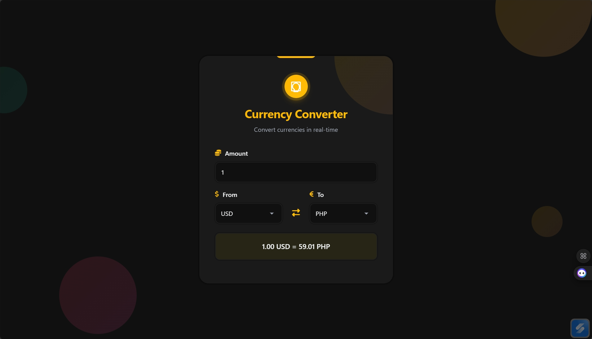

# Currency Converter

A modern, responsive Currency Converter built with pure HTML, CSS, and JavaScript. Converts currencies in real time using live exchange rates from the free Frankfurter API. Updates instantly as you type or change currencies.

[**Try the Live Demo**](https://lorainecastro.github.io/currency-converter/)

## Supported Currencies
Powered by Frankfurter API – includes all major currencies:
USD, EUR, GBP, JPY, PHP, INR, CAD, AUD, CHF, CNY, KRW, BRL, MXN, And many more…

## API Used
- Endpoint: [**https://api.frankfurter.dev/v1**](https://api.frankfurter.dev/v1)
- Source: [**https://www.frankfurter.dev**](https://www.frankfurter.dev)
- Completely free, no API key needed

